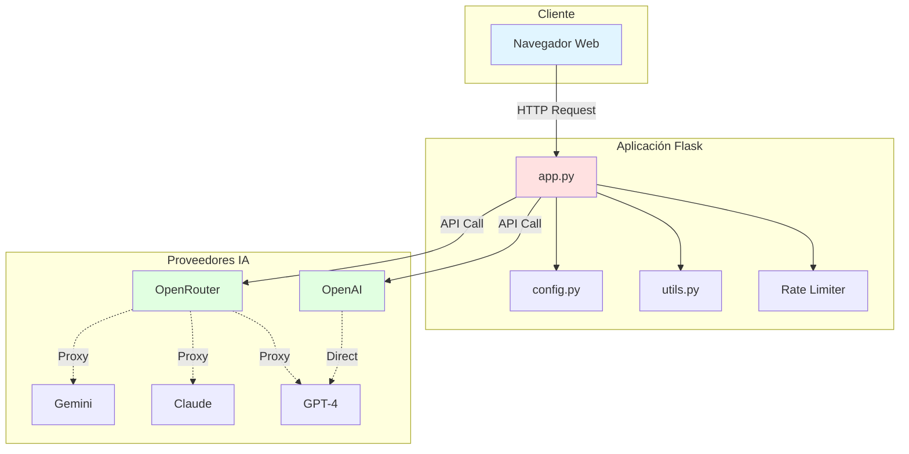
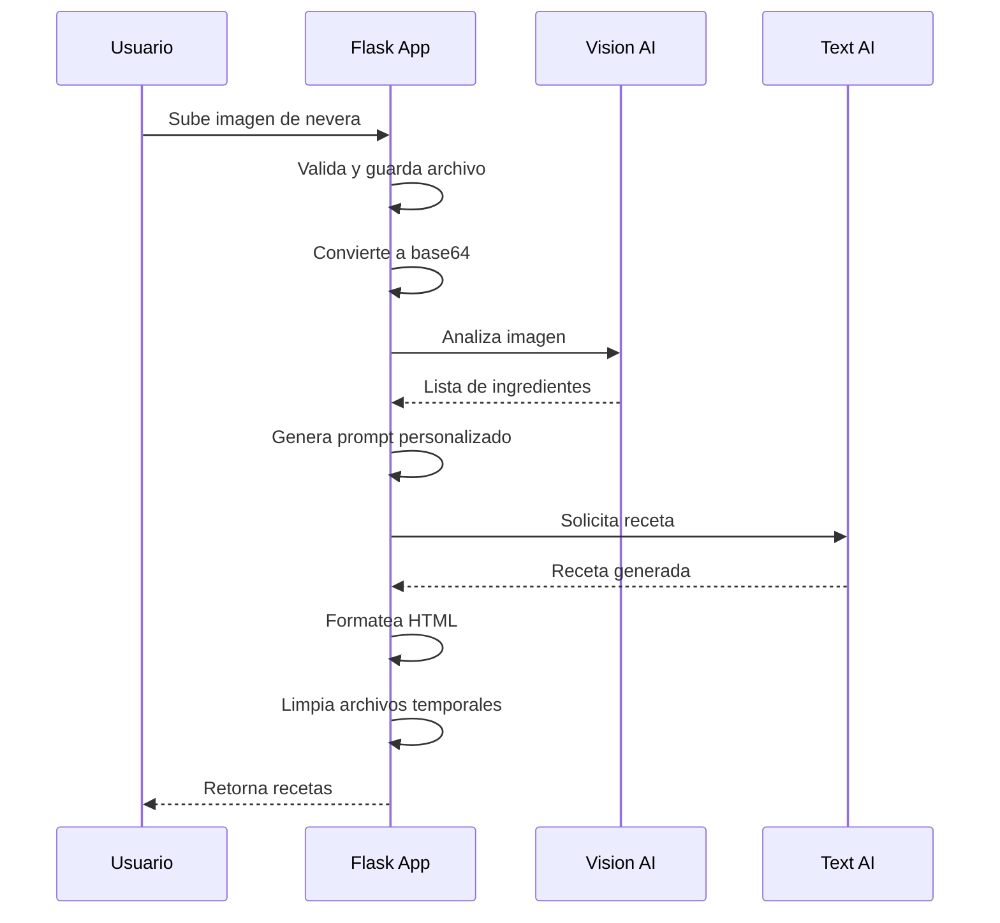
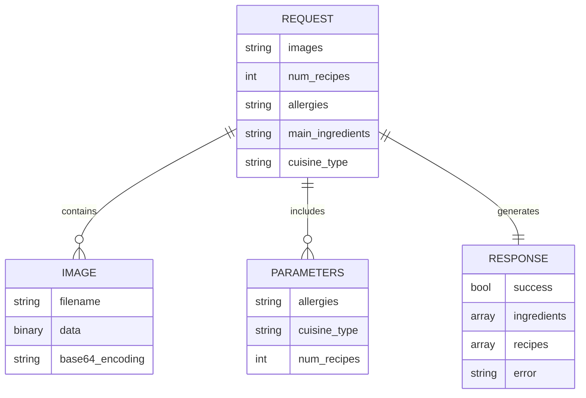
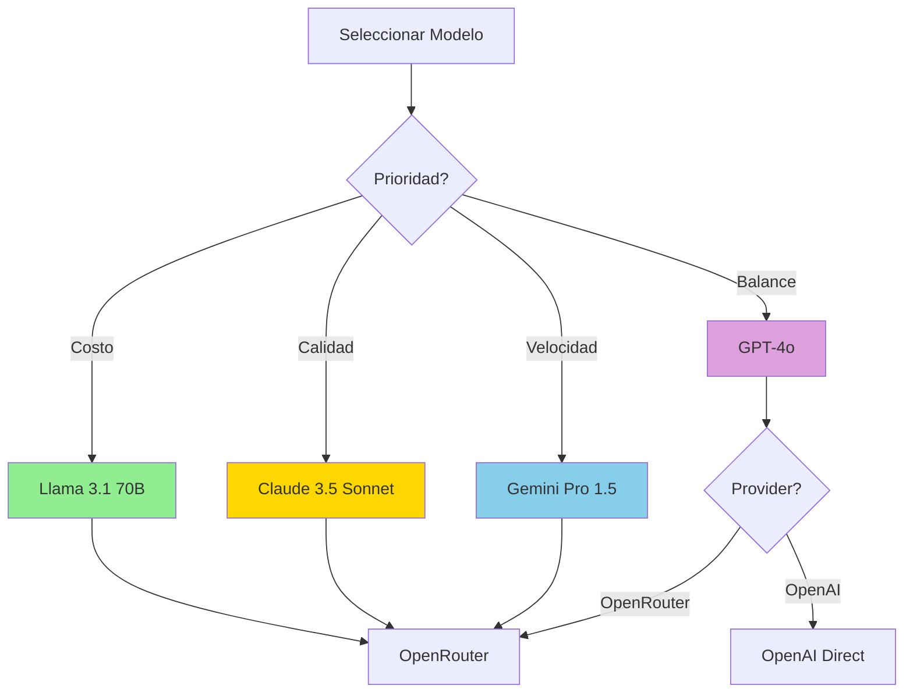
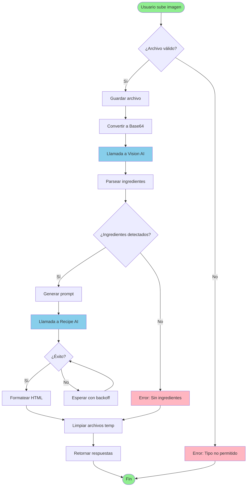
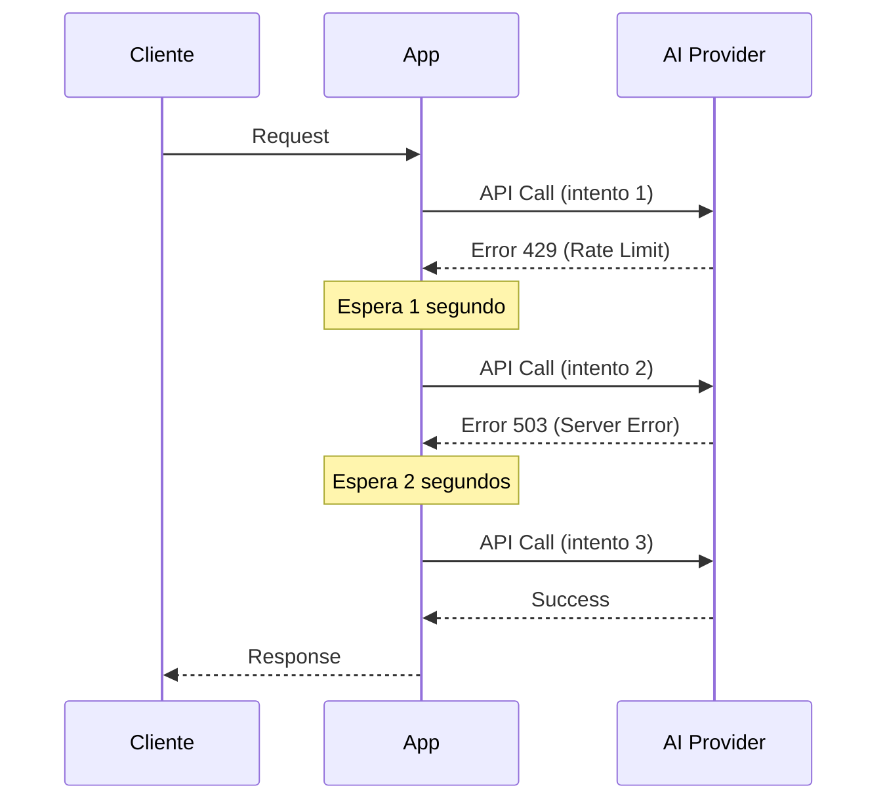
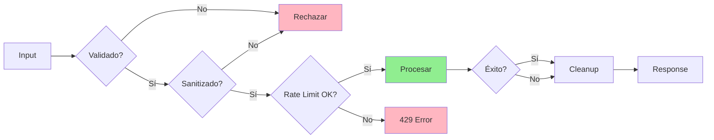
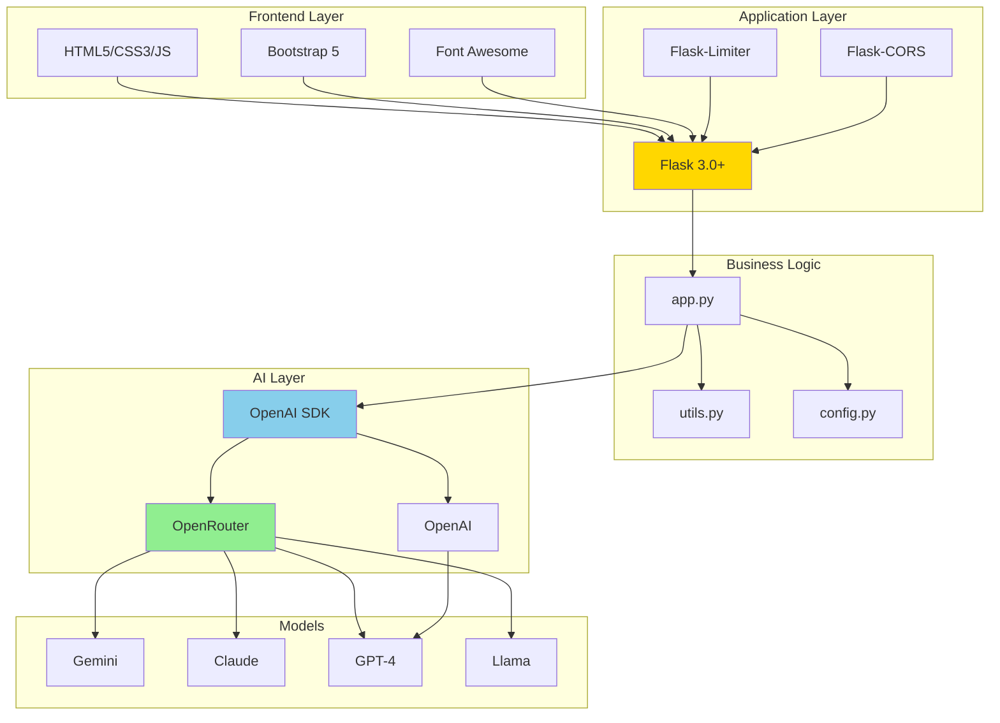
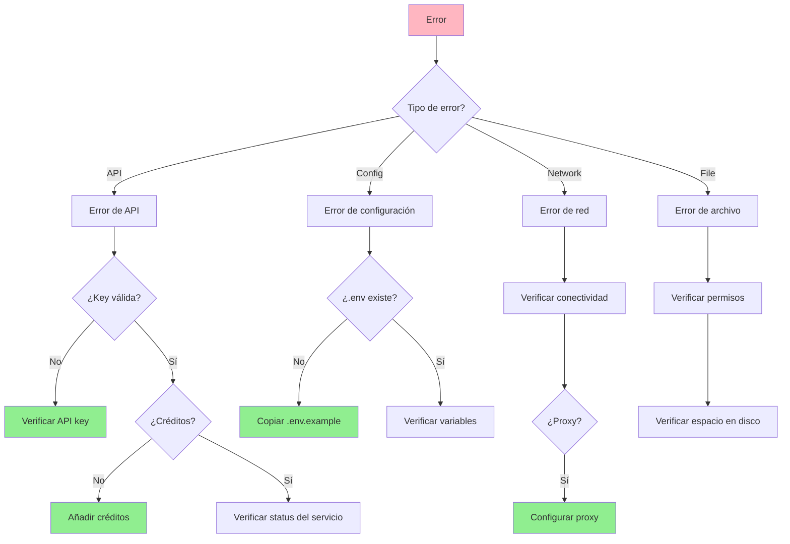
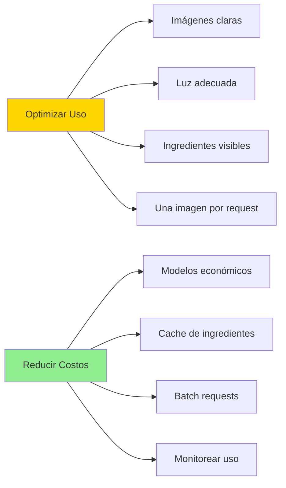

# AI PHOTO KITCHEN ASSISTANT V2.0


**Author**: [686f6c61](https://github.com/686f6c61)
**Updated**: 2025-01-24
**License**: MIT

---

## TABLE OF CONTENTS

1. [DESCRIPCION](#descripcion)
2. [CARACTERISTICAS](#caracteristicas)
3. [ARQUITECTURA](#arquitectura)
4. [INSTALACION](#instalacion)
   - [Requisitos Previos](#requisitos-previos)
   - [Obtener API Keys](#obtener-api-keys)
   - [Pasos de Instalación](#pasos-de-instalacion)
5. [CONFIGURACION](#configuracion)
   - [Variables de Entorno](#variables-de-entorno)
   - [Modelos Recomendados](#modelos-recomendados)
6. [USO](#uso)
7. [ESTRUCTURA DEL PROYECTO](#estructura-del-proyecto)
8. [FLUJO DE TRABAJO](#flujo-de-trabajo)
9. [SEGURIDAD](#seguridad)
10. [TECNOLOGIAS](#tecnologias)
11. [SOLUCION DE PROBLEMAS](#solucion-de-problemas)
12. [LIMITACIONES](#limitaciones)
13. [CONTRIBUCION](#contribucion)
14. [LICENCIA](#licencia)
15. [AUTOR](#autor)

---

## DESCRIPCION

Aplicación web inteligente que utiliza IA multimodal para analizar fotografías de tu nevera o alacena y generar recetas personalizadas basadas en los ingredientes disponibles.

La aplicación combina modelos de visión por computadora para identificar ingredientes y modelos de lenguaje avanzados para crear recetas detalladas, adaptadas a restricciones dietéticas y preferencias culinarias.


---

## CARACTERISTICAS

### FUNCIONALIDADES PRINCIPALES

- **Análisis Visual Avanzado**: Detección de ingredientes mediante modelos de visión IA
- **Recetas Personalizadas**: Generación adaptada a ingredientes disponibles
- **Gestión de Restricciones**: Soporte para alergias y preferencias dietéticas
- **Estilos Culinarios**: Múltiples cocinas (italiana, mexicana, española, mediterránea, etc.)
- **Listas de Compra**: Generación automática de ingredientes faltantes
- **Formato Profesional**: Recetas con estructura de chef profesional

### CARACTERISTICAS TECNICAS

- **Multi-Provider AI**: Compatible con OpenRouter y OpenAI
- **Rate Limiting**: Protección contra abuso de API
- **Error Handling**: Reintentos automáticos con backoff exponencial
- **Logging Completo**: Registro detallado para debugging y auditoría
- **Secure File Handling**: Validación y sanitización de archivos
- **Clean Architecture**: Código modular y bien documentado

### FORMATO DE RECETAS

Cada receta incluye:
- Nombre creativo y apetitoso
- Lista de ingredientes con cantidades exactas
- Tiempos de preparación y cocción
- Nivel de dificultad y técnicas requeridas
- Instrucciones paso a paso detalladas
- Consejos profesionales del chef
- Información nutricional aproximada
- Lista de compras para ingredientes faltantes

---

## ARQUITECTURA

### DIAGRAMA DE COMPONENTES



### FLUJO DE PROCESAMIENTO



### MODELO DE DATOS



---

## INSTALACION

### REQUISITOS PREVIOS

- **Python 3.9+** (recomendado 3.11 o superior)
- **API Key** de OpenRouter (recomendado) o OpenAI
- **Git** para clonar el repositorio

### OBTENER API KEYS

#### OPENROUTER (RECOMENDADO)

OpenRouter proporciona acceso unificado a múltiples modelos de IA:

1. Regístrate en [openrouter.ai](https://openrouter.ai/)
2. Navega a [openrouter.ai/keys](https://openrouter.ai/keys)
3. Crea una nueva API key
4. Copia y guarda la clave generada

**Modelos disponibles via OpenRouter**:
- `google/gemini-pro-1.5-exp` - Excelente para visión, rápido y económico
- `anthropic/claude-3.5-sonnet` - Recetas creativas y detalladas
- `openai/gpt-4o` - Rendimiento balanceado y confiable
- `meta-llama/llama-3.1-70b-instruct` - Open source, muy económico
- Y docenas de modelos más

#### OPENAI (ALTERNATIVA)

1. Regístrate en [platform.openai.com/signup](https://platform.openai.com/signup)
2. Ve a [platform.openai.com/api-keys](https://platform.openai.com/api-keys)
3. Crea una nueva secret key
4. Copia la clave (no podrás verla de nuevo)

### PASOS DE INSTALACION

```bash
# 1. Clonar el repositorio
git clone https://github.com/686f6c61/AI-Photo-Kitchen-Assistant.git
cd AI-Photo-Kitchen-Assistant

# 2. Crear entorno virtual (recomendado)
python3 -m venv venv
source venv/bin/activate  # En Windows: venv\Scripts\activate

# 3. Instalar dependencias
pip install -r requirements.txt

# 4. Configurar variables de entorno
cp .env.example .env

# 5. Editar configuración
nano .env  # O tu editor preferido

# 6. Ejecutar la aplicación
python app.py
```

### CONFIGURACION RAPIDA

Edita el archivo `.env` con tu API key:

```bash
# Opción 1: OpenRouter (Recomendado)
OPENROUTER_API_KEY=sk-or-v1-tu-api-key-aqui
IMAGE_MODEL=google/gemini-pro-1.5-exp
RECIPE_MODEL=anthropic/claude-3.5-sonnet

# Opción 2: OpenAI
OPENAI_API_KEY=sk-tu-api-key-aqui
IMAGE_MODEL=gpt-4o-mini
RECIPE_MODEL=gpt-4o

# Seguridad (importante para producción)
FLASK_SECRET_KEY=genera-una-clave-segura-aleatoria-larga
```

---

## CONFIGURACION

### VARIABLES DE ENTORNO

Todas las opciones están documentadas en `.env.example`. Las principales:

#### PROVEEDOR DE IA

```bash
# OpenRouter (multi-modelo)
OPENROUTER_API_KEY=sk-or-v1-...
OPENROUTER_BASE_URL=https://openrouter.ai/api/v1
IMAGE_MODEL=google/gemini-pro-1.5-exp
RECIPE_MODEL=anthropic/claude-3.5-sonnet

# OpenAI (alternativa)
OPENAI_API_KEY=sk-...
IMAGE_MODEL=gpt-4o-mini
RECIPE_MODEL=gpt-4o
```

#### RATE LIMITING

```bash
RATE_LIMIT_PER_MINUTE=10  # Requests por minuto por IP
RATE_LIMIT_PER_HOUR=50    # Requests por hora por IP
```

#### SERVIDOR

```bash
HOST=0.0.0.0              # Bind address
PORT=5050                 # Puerto del servidor
FLASK_ENV=production      # production o development
```

#### ARCHIVOS

```bash
MAX_CONTENT_LENGTH=16777216  # 16MB máximo
UPLOAD_FOLDER=temp_uploads    # Carpeta temporal
```

#### LOGGING

```bash
LOG_LEVEL=INFO      # DEBUG, INFO, WARNING, ERROR, CRITICAL
LOG_FILE=app.log    # Archivo de logs
```

### MODELOS RECOMENDADOS

| TAREA | MODELO OPENROUTER | MODELO OPENAI | CARACTERISTICAS |
|-------|-------------------|---------------|-----------------|
| **Visión** | `google/gemini-pro-1.5-exp` | `gpt-4o` | Rápido, preciso, económico |
| **Recetas** | `anthropic/claude-3.5-sonnet` | `gpt-4o` | Creativo, detallado |
| **Económico** | `meta-llama/llama-3.1-70b-instruct` | `gpt-4o-mini` | Open source, bajo costo |
| **Balanced** | `openai/gpt-4o` via OpenRouter | `gpt-4o` | Todo propósito |

#### MATRIZ DE DECISION DE MODELOS



---

## USO

### INICIO RAPIDO

```bash
# Método 1: Script de conveniencia
chmod +x run.sh
./run.sh

# Método 2: Directamente con Python
python app.py

# Método 3: Con Gunicorn (producción)
gunicorn -w 4 -b 0.0.0.0:5050 app:app
```

### ACCESO A LA APLICACION

1. Abre tu navegador en `http://localhost:5050`
2. Sube una foto de tu nevera o alacena
3. (Opcional) Añade restricciones alimentarias
4. (Opcional) Especifica tipo de cocina preferida
5. Haz clic en "Generar Recetas"
6. Espera el análisis y generación de recetas
7. Copia las recetas o lista de compras

### EJEMPLO CON CURL

```bash
curl -X POST http://localhost:5050/analyze \
  -F "images=@mi_nevera.jpg" \
  -F "allergies=gluten,lactosa" \
  -F "cuisine_type=mediterranea" \
  -F "num_recipes=2"
```

### RESPUESTA JSON

```json
{
  "success": true,
  "ingredients": [
    "pollo",
    "tomates",
    "cebolla",
    "ajo",
    "aceite de oliva"
  ],
  "recipes": [
    "<div class='recipe-card'>...</div>",
    "<div class='recipe-card'>...</div>"
  ]
}
```

---

## ESTRUCTURA DEL PROYECTO

```
AI-Photo-Kitchen-Assistant/
├── app.py                 # Aplicación principal Flask
├── config.py              # Configuración y validación
├── utils.py               # Funciones utilitarias
├── requirements.txt       # Dependencias Python
├── .env.example          # Plantilla de configuración
├── .gitignore            # Exclusiones de Git
├── run.sh                # Script de inicio
├── LICENSE               # Licencia MIT
├── README.md             # Este archivo
├── CHANGELOG.md          # Historial de cambios
│
├── templates/
│   └── index.html        # Interfaz web principal
│
├── static/
│   ├── css/
│   │   └── styles.css    # Estilos personalizados
│   ├── js/
│   │   └── main.js       # Lógica del cliente
│   └── images/
│       └── fridge.svg    # Recursos gráficos
│
└── img/
    ├── recetas1.png      # Screenshots para documentación
    └── recetas2.png
```

### DEPENDENCIAS CLAVE

```
flask>=3.0.0           # Framework web
openai>=1.12.0         # Cliente AI (compatible con OpenRouter y OpenAI)
python-dotenv>=1.0.0   # Gestión de configuración
flask-limiter>=3.5.0   # Rate limiting
flask-cors>=4.0.0      # CORS support
requests>=2.31.0       # HTTP requests
Werkzeug>=3.0.0        # Utilidades WSGI
```

---

## FLUJO DE TRABAJO

### PROCESO COMPLETO



### ANALISIS DE IMAGEN

```python
# Cliente OpenRouter/OpenAI inicializado
client = OpenAI(
    api_key=config.OPENROUTER_API_KEY,
    base_url="https://openrouter.ai/api/v1"
)

# Análisis visual con modelo de visión
response = client.chat.completions.create(
    model="google/gemini-pro-1.5-exp",
    messages=[{
        "role": "user",
        "content": [
            {
                "type": "text",
                "text": "Analiza esta imagen y lista los ingredientes..."
            },
            {
                "type": "image_url",
                "image_url": {
                    "url": f"data:image/jpeg;base64,{base64_image}"
                }
            }
        ]
    }],
    max_tokens=2000,
    temperature=0.3
)
```

### GENERACION DE RECETAS

```python
# Generación con modelo de texto
response = client.chat.completions.create(
    model="anthropic/claude-3.5-sonnet",
    messages=[
        {
            "role": "system",
            "content": "Eres un chef profesional con 20 años de experiencia..."
        },
        {
            "role": "user",
            "content": prompt_generado
        }
    ],
    temperature=0.8,
    max_tokens=3000
)
```

### RETRY LOGIC



---

## SEGURIDAD

### MEJORAS IMPLEMENTADAS

**Rate Limiting**
- Protección contra abuso por dirección IP
- Límites configurables por minuto y hora
- Respuestas 429 Too Many Requests cuando se excede

**Validación de Inputs**
- Sanitización de todos los inputs de usuario
- Validación de tipos de archivo (whitelist)
- Validación de tamaños de archivo
- Escape de caracteres especiales

**Manejo Seguro de Archivos**
- Nombres de archivo sanitizados con `secure_filename()`
- Limpieza automática de archivos temporales
- Validación de extensiones contra whitelist
- Protección contra path traversal

**Variables de Entorno**
- Todos los secretos vía environment variables
- Sin credenciales hardcodeadas en código
- Generación automática de SECRET_KEY en desarrollo
- Advertencias en producción si faltan configuraciones

**CORS Configurado**
- Control de acceso cross-origin
- Configurable para dominios específicos
- Headers de seguridad apropiados

**Logging y Auditoría**
- Registro completo de operaciones
- Sin exposición de información sensible en logs
- Auditoría de errores y excepciones
- Logs rotables para producción

### BEST PRACTICES

```python
# CORRECTO: Usar environment variables
OPENROUTER_API_KEY = os.environ.get('OPENROUTER_API_KEY')

# INCORRECTO: Hardcodear secretos
OPENROUTER_API_KEY = "sk-or-v1-..."

# CORRECTO: Validar tipos de archivo
if not allowed_file(filename):
    return error_response("Tipo de archivo no permitido")

# CORRECTO: Limpiar archivos temporales
try:
    process_file(filepath)
finally:
    clean_temp_files(filepath)

# CORRECTO: Rate limiting en endpoints
@app.route('/analyze', methods=['POST'])
@limiter.limit(f"{Config.RATE_LIMIT_PER_MINUTE}/minute")
def analyze():
    pass
```

### CHECKLIST DE SEGURIDAD



---

## TECNOLOGIAS

### BACKEND

**Framework**
- Flask 3.0+ - Framework web moderno y ligero
- Werkzeug 3.0+ - Utilidades WSGI

**AI/ML**
- OpenAI SDK - Cliente unificado para APIs de IA
- Compatible con OpenRouter y OpenAI

**Seguridad**
- Flask-Limiter - Rate limiting por IP
- Flask-CORS - Cross-Origin Resource Sharing

**Configuración**
- Python-dotenv - Gestión de environment variables
- Secrets - Generación de claves seguras

### FRONTEND

- HTML5, CSS3, JavaScript
- Bootstrap 5 - Framework CSS responsivo
- Font Awesome - Biblioteca de iconos
- Bootstrap Tags Input - Gestión de etiquetas

### IA/ML PROVIDERS

**OpenRouter** (Gateway unificado)
- Google Gemini Pro 1.5
- Anthropic Claude 3.5 Sonnet
- OpenAI GPT-4/GPT-4o
- Meta Llama 3.1 70B
- Y más de 50 modelos adicionales

**OpenAI** (Directo)
- GPT-4o
- GPT-4o-mini
- GPT-4 Turbo
- GPT-4 Vision

### STACK COMPLETO



---

## SOLUCION DE PROBLEMAS

### ERROR: NO AI PROVIDER CONFIGURED

```bash
# Verificar que al menos una API key esté configurada
echo $OPENROUTER_API_KEY
# o
echo $OPENAI_API_KEY

# Si está vacía, editar .env
nano .env

# Añadir:
OPENROUTER_API_KEY=tu-api-key-aqui
```

### ERROR: RATE LIMIT EXCEEDED

```bash
# Ajustar los límites en .env
RATE_LIMIT_PER_MINUTE=5
RATE_LIMIT_PER_HOUR=25

# Reiniciar la aplicación
python app.py
```

### ERROR: PUERTO OCUPADO

```bash
# Encontrar proceso usando el puerto
lsof -i :5050

# Opción 1: Matar el proceso
kill -9 PID

# Opción 2: Cambiar puerto en .env
PORT=8080
```

### ERRORES DE API

**Verificación de API Key**
```bash
# Verificar formato de la key
echo $OPENROUTER_API_KEY | head -c 20

# Debe empezar con sk-or-v1- para OpenRouter
# o sk- para OpenAI
```

**Verificar Créditos**
1. OpenRouter: [openrouter.ai/credits](https://openrouter.ai/credits)
2. OpenAI: [platform.openai.com/account/usage](https://platform.openai.com/account/usage)

**Estado del Servicio**
- OpenRouter: [status.openrouter.ai](https://status.openrouter.ai)
- OpenAI: [status.openai.com](https://status.openai.com)

### LOGS DE DEBUG

```bash
# Habilitar modo debug temporalmente
LOG_LEVEL=DEBUG python app.py

# O configurar permanentemente en .env
LOG_LEVEL=DEBUG
FLASK_ENV=development
```

### DIAGNOSTICO COMPLETO



---

## LIMITACIONES

### LIMITACIONES TECNICAS

- **Detección de Ingredientes**: Depende de la calidad y claridad de la imagen
- **Ingredientes Raros**: Alimentos poco comunes pueden no ser reconocidos correctamente
- **Tiempo de Respuesta**: Varía según carga del proveedor de IA (5-30 segundos típicamente)
- **Tamaño de Imagen**: Limitado a 16MB por archivo

### LIMITACIONES DE COSTO

- **Costos Variables**: El uso frecuente incrementa costos de API
- **Rate Limits**: Límites de requests según plan de API
- **Tokens**: Recetas detalladas consumen más tokens

### RECOMENDACIONES



---

## CONTRIBUCION

Las contribuciones son bienvenidas. Para contribuir al proyecto:

### COMO CONTRIBUIR

```bash
# 1. Fork el repositorio
git clone https://github.com/TU-USUARIO/AI-Photo-Kitchen-Assistant.git

# 2. Crear rama para tu feature
git checkout -b feature/nueva-funcionalidad

# 3. Hacer cambios y commit
git add .
git commit -m "Add: descripción de cambios"

# 4. Push a tu fork
git push origin feature/nueva-funcionalidad

# 5. Abrir Pull Request en GitHub
```

### GUIDELINES

- Seguir el estilo de código existente
- Añadir docstrings a todas las funciones
- Incluir type hints cuando sea posible
- Actualizar documentación si es necesario
- Añadir tests para nuevas funcionalidades

### IDEAS PARA CONTRIBUCIONES

**Nuevas Funcionalidades**
- Soporte multiidioma (i18n/l10n)
- Sistema de historial de recetas
- Exportación a PDF o Word
- Integración con calendarios de comidas
- Sistema de favoritos y ratings

**Mejoras Técnicas**
- Tests unitarios y de integración
- Dockerización completa
- CI/CD con GitHub Actions
- Cache con Redis
- Base de datos para persistencia

**Mejoras de UI/UX**
- Temas personalizables (dark mode)
- Progressive Web App (PWA)
- Mejoras en responsive design
- Animaciones y transiciones
- Tutorial interactivo

---

## LICENCIA

Este proyecto está licenciado bajo la **MIT License**.

```
MIT License

Copyright (c) 2024-2025 686f6c61

Permission is hereby granted, free of charge, to any person obtaining a copy
of this software and associated documentation files (the "Software"), to deal
in the Software without restriction, including without limitation the rights
to use, copy, modify, merge, publish, distribute, sublicense, and/or sell
copies of the Software, and to permit persons to whom the Software is
furnished to do so, subject to the following conditions:

The above copyright notice and this permission notice shall be included in all
copies or substantial portions of the Software.

THE SOFTWARE IS PROVIDED "AS IS", WITHOUT WARRANTY OF ANY KIND, EXPRESS OR
IMPLIED, INCLUDING BUT NOT LIMITED TO THE WARRANTIES OF MERCHANTABILITY,
FITNESS FOR A PARTICULAR PURPOSE AND NONINFRINGEMENT. IN NO EVENT SHALL THE
AUTHORS OR COPYRIGHT HOLDERS BE LIABLE FOR ANY CLAIM, DAMAGES OR OTHER
LIABILITY, WHETHER IN AN ACTION OF CONTRACT, TORT OR OTHERWISE, ARISING FROM,
OUT OF OR IN CONNECTION WITH THE SOFTWARE OR THE USE OR OTHER DEALINGS IN THE
SOFTWARE.
```

Ver archivo [LICENSE](LICENSE) para detalles completos.

---

## AUTOR

**686f6c61**

- GitHub: [@686f6c61](https://github.com/686f6c61)
- Repository: [AI-Photo-Kitchen-Assistant](https://github.com/686f6c61/AI-Photo-Kitchen-Assistant)
- Issues: [Reportar problemas](https://github.com/686f6c61/AI-Photo-Kitchen-Assistant/issues)
- Pull Requests: [Contribuir](https://github.com/686f6c61/AI-Photo-Kitchen-Assistant/pulls)

---
